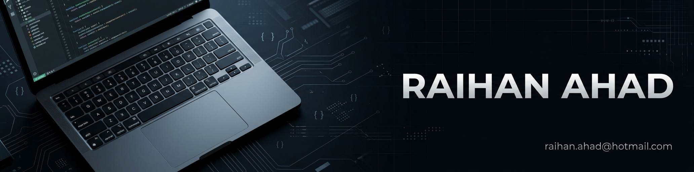

# RAIHAN_AHAD

  

<h1 align="center">Hi, I'm Raihan Ahad! 👋</h1>

CSE Student | Competitive Programmer 

  
  

## About Me

<h3>👋 Hello! I'm Raihan Ahad, a passionate CSE student and aspiring Competitive Programmer.</h3>

- 🎓 Currently pursuing Computer Science & Engineering (CSE) at Premier University, Chittagong.
- 💻 Learning Data Structures & Algorithms
- 🧠 Passionate about Competitive Programming & Problem Solving
- 🚀 Practicing C++ and improving my programming skills
- 📚 Exploring new technologies and expanding my knowledge
- ✉️ Contact: raihan.ahad@hotmail.com

<!---
raihanahad/raihanahad is a ✨ special ✨ repository because its `README.md` (this file) appears on your GitHub profile.
You can click the Preview link to take a look at your changes.
--->
